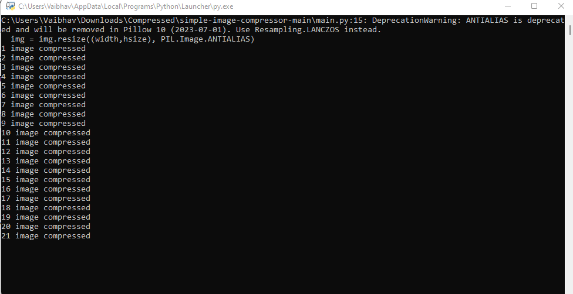

<div align="center">
  
  
<b>Compress and Optimise multiple images in a single click without compromising the Image quality</b>
</div>

<h2><b>Prerequisites</b></h2>

Pillow 
```
 pip install Pillow
```
<h2><b>Installation And Usage</b></h2>

1. Download the Code
4. Put your images<i>(that you want to compress)</i> in the input folder
6. Run the main.py file and select your prefered options
7. After completion open the output folder and here are your compressed images.
8. Enjoy!!!

<h2><b>Screenshots</b></h2>



<h2><b>Errors</b></h2>
If you face any error then <a href="mailto:varunsaini98174@gmail.com">email<a> me your error
